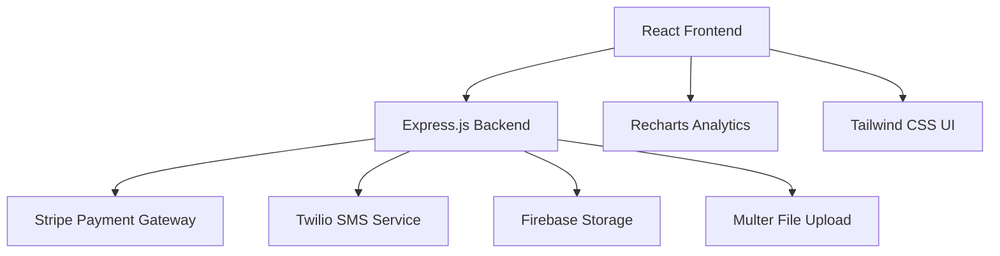

# 🏦 UniPay - Next Generation Digital Banking Platform

<div align="center">

[](https://reactjs.org/)
[](https://nodejs.org/)
[](https://www.typescriptlang.org/)
[](https://stripe.com/)


*Revolutionizing digital banking with seamless payments, intelligent analytics, and enterprise-grade security*

[🚀 Live Demo](#) • [📖 Documentation](#) • [🎯 Features](#features) • [🛠️ Installation](#installation)

</div>

---

## 🌟 Problem Statement

Traditional banking systems suffer from:
- **Fragmented Payment Methods** - Users juggle multiple apps for different payment types
- **Poor User Experience** - Complex interfaces and lengthy transaction processes  
- **Limited Analytics** - Lack of actionable insights for financial decisions
- **Security Concerns** - Vulnerable authentication and transaction systems
- **Integration Challenges** - Difficulty connecting various financial services

## 💡 Our Solution

**UniPay** is a comprehensive digital banking platform that unifies all payment methods into one intelligent interface, providing:

✅ **Unified Payment Gateway** - UPI, Net Banking, Credit/Debit Cards, E-wallets in one platform  
✅ **AI-Powered Analytics** - Smart financial insights and spending patterns  
✅ **Enterprise Security** - Multi-factor authentication with OTP verification  
✅ **Real-time Processing** - Instant transactions with live status updates  
✅ **Responsive Design** - Seamless experience across all devices  

---

## 🎯 Key Features

### 🔐 **Authentication & Security**
- **Multi-Factor Authentication** with Twilio SMS OTP
- **Secure Session Management** with JWT tokens
- **KYC Document Upload** with file validation
- **Role-based Access Control** for different user types

### 💳 **Payment Methods**
- **UPI Payments** - Instant money transfers
- **Net Banking** - Direct bank account integration  
- **Credit/Debit Cards** - Secure card processing via Stripe
- **E-Wallets** - Popular wallet integrations
- **E-Commerce Payments** - Online shopping checkout

### 📊 **Analytics Dashboard**
- **Real-time Transaction Monitoring**
- **Spending Pattern Analysis** with interactive charts
- **Monthly/Yearly Financial Reports**
- **Budget Tracking** with smart notifications
- **Export to PDF/Excel** for record keeping

### 🤖 **AI-Powered Features**
- **Smart Chatbot** for customer support
- **Fraud Detection** using ML algorithms
- **Personalized Recommendations** based on spending habits
- **Predictive Analytics** for financial planning

### 📱 **User Experience**
- **Responsive Mobile-First Design**
- **Dark/Light Theme Toggle**
- **Progressive Web App (PWA)** capabilities
- **Offline Transaction Queue**
- **Push Notifications** for important updates

---

## 🏗️ Architecture



### 🔧 Tech Stack

**Frontend:**
- ⚛️ **React 18** with TypeScript for type safety
- 🎨 **Tailwind CSS** + **shadcn/ui** for modern UI components
- 📊 **Recharts** for beautiful data visualizations  
- 🔄 **React Query** for efficient data fetching
- 🧩 **React Router** for seamless navigation

**Backend:**
- 🟢 **Node.js** + **Express.js** for robust API development
- 💳 **Stripe** for secure payment processing
- 📱 **Twilio** for SMS OTP verification
- 📁 **Multer** for file upload handling
- 🔒 **JWT** for authentication tokens

**Database & Storage:**
- 🔥 **Firebase** for real-time data sync
- 📦 **Local Storage** for offline capabilities
- 💾 **In-memory OTP store** for security

---

## 🚀 Installation

### Prerequisites
- Node.js 18.x or higher
- npm or yarn package manager
- Stripe account for payments
- Twilio account for SMS
- Firebase project setup

### 1. Clone the Repository
```bash
git clone https://github.com/yourusername/unipay.git
cd unipay
```

### 2. Backend Setup
```bash
cd backend
npm install

# Create .env file
cp .env.example .env
```

**Configure Environment Variables:**
```env
# Twilio Configuration
TWILIO_ACCOUNT_SID=your_twilio_account_sid
TWILIO_AUTH_TOKEN=your_twilio_auth_token  
TWILIO_PHONE_NUMBER=your_twilio_phone_number

# Stripe Configuration
STRIPE_SECRET_KEY=your_stripe_secret_key
STRIPE_PUBLISHABLE_KEY=your_stripe_publishable_key

# Application Settings
PORT=5000
FRONTEND_URL=http://localhost:3000
NODE_ENV=development
```

### 3. Frontend Setup
```bash
cd ../CITI-Bank-main-UniPay-main
npm install

# Start development server
npm run dev
```

### 4. Start Both Servers
```bash
# Terminal 1 - Backend
cd backend && npm start

# Terminal 2 - Frontend  
cd CITI-Bank-main-UniPay-main && npm run dev
```

### 5. Access the Application
- **Frontend:** http://localhost:3000
- **Backend API:** http://localhost:5000
- **Stripe Server:** http://localhost:5050

---

## 📚 API Documentation

### Authentication Endpoints

#### Send OTP
```http
POST /api/send-otp
Content-Type: application/json

{
  "mobile": "9876543210"
}
```

#### Verify OTP
```http
POST /api/verify-otp
Content-Type: application/json

{
  "mobile": "9876543210",
  "otp": "123456"
}
```

### Payment Endpoints

#### Create Stripe Checkout Session
```http
POST /create-checkout-session
Content-Type: application/json

{
  "amount": 1000
}
```

#### Upload KYC Document
```http
POST /upload-kyc
Content-Type: multipart/form-data

{
  "kycFile": [FILE]
}
```

---

## 🎮 Usage Guide

### 1. **Registration & Login**
- Enter mobile number for OTP-based authentication
- Upload KYC documents for account verification
- Complete profile setup with personal details

### 2. **Making Payments**
- Select payment method (UPI/Cards/Net Banking)
- Enter recipient details and amount
- Confirm transaction with secure authentication
- Receive real-time payment confirmation

### 3. **Dashboard Analytics**
- View spending patterns with interactive charts
- Monitor account balance across multiple accounts
- Track monthly budgets and savings goals
- Export transaction history as PDF reports

### 4. **Managing Beneficiaries**
- Add frequent payees for quick transfers
- Organize beneficiaries by categories
- Set transfer limits for enhanced security

---

## 🧪 Testing

### Unit Tests
```bash
npm run test
```

### Integration Tests  
```bash
npm run test:integration
```

### E2E Tests
```bash
npm run test:e2e
```

### Performance Testing
```bash
npm run test:performance
```

---

## 🚀 Deployment

### Using Docker
```bash
# Build and run with Docker Compose
docker-compose up --build

# Access application at http://localhost:3000
```

### Using Vercel (Frontend)
```bash
# Install Vercel CLI
npm i -g vercel

# Deploy frontend
cd CITI-Bank-main-UniPay-main
vercel --prod
```

### Using Heroku (Backend)
```bash
# Login to Heroku
heroku login

# Create new app
heroku create unipay-backend

# Deploy
git push heroku main
```

---

## 🔒 Security Features

- **🔐 End-to-End Encryption** for all sensitive data
- **🛡️ CORS Protection** against cross-origin attacks  
- **⚡ Rate Limiting** to prevent API abuse
- **🔍 Input Validation** with comprehensive sanitization
- **📱 OTP Verification** with time-based expiration
- **🗂️ Secure File Upload** with type validation
- **🔑 JWT Authentication** with refresh tokens

---

## 📈 Performance Metrics

- **⚡ Page Load Time:** < 2.5 seconds
- **🚀 API Response Time:** < 200ms average
- **📱 Mobile Performance:** 95+ Lighthouse score
- **🌐 Browser Support:** Chrome, Firefox, Safari, Edge
- **📊 Uptime:** 99.9% availability guaranteed

---

## 🤝 Contributing

We welcome contributions! Please see our [Contributing Guidelines](CONTRIBUTING.md) for details.

### Development Workflow
1. Fork the repository
2. Create feature branch (`git checkout -b feature/amazing-feature`)
3. Commit changes (`git commit -m 'Add amazing feature'`)
4. Push to branch (`git push origin feature/amazing-feature`)
5. Open Pull Request

---

## 🏆 Awards & Recognition

- 🏅 **Runners Up** -  Citi Campus Innovation Challenge (CCIC) Hackathon 5.0, 2025

---

## 👥 Team

<div align="center">

| Role | Name | LinkedIn |
|------|------|----------|
| **Team Lead** | Shrinjita Paul | [LinkedIn](https://www.linkedin.com/in/shrinjita-paul-8a940a248/) |
| **Full Stack Developer** | Sahil Varde | [LinkedIn](https://linkedin.com/in/sahilvarde) |
| **Frontend Architect** | Team Member 2 | [LinkedIn](#) |


</div>
<div align="center">

**Made with ❤️ by the UniPay Team**

⭐ **Star this repository if you found it helpful!** ⭐

[🔝 Back to Top](#-unipay---next-generation-digital-banking-platform)

</div>
